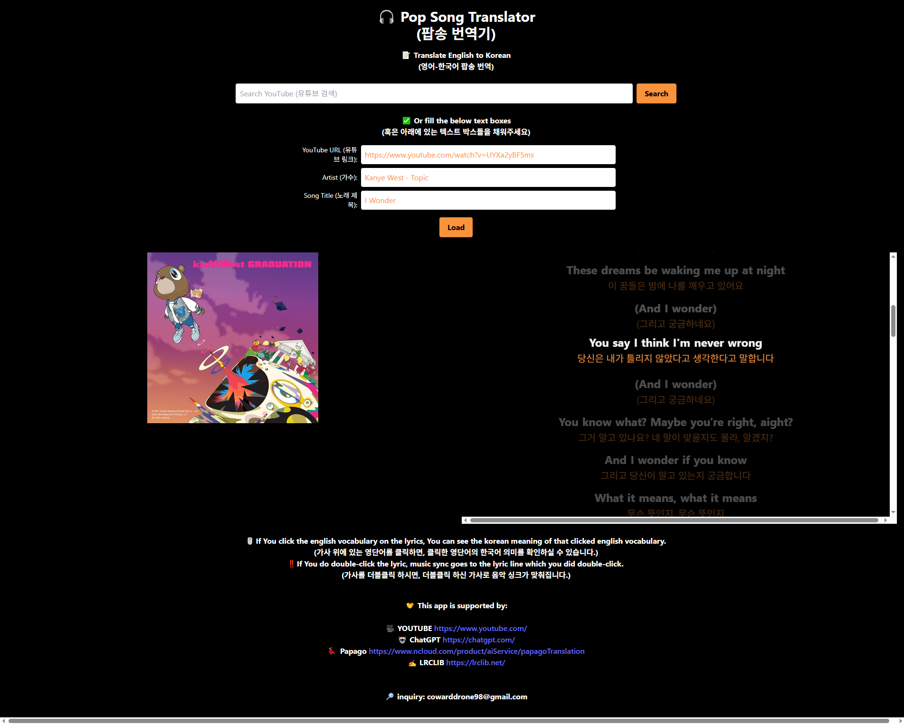

# 🎵 Pop Song Translator (팝송 번역기)

🌍 [Live Site](https://pop-song-translator.onrender.com/) • 🎙️ Translate English to Korean Lyrics

**Pop Song Translator** is a stylish and intuitive web application that translates English pop lyrics into Korean. Whether you're learning English or Korean through music, diving deep into lyric meanings, or just vibing with Pop or K-pop energy — this tool is built for you.



---

## ✨ Key Features

- 🎧 **English to Korean Lyric Translation**
  - Translates full lyrics or selected words using **DeepL**  AI.
- 🔍 **YouTube Integration**
  - Paste a YouTube link or search for a song directly.
- ⏱️ **Auto Synced Lyrics**
  - LRC-based syncing lets you follow the song line-by-line.
- 🖱️ **Click Vocabulary Lookup**
  - Click any English word to view its Korean meaning instantly.
- 🎯 **Double-Click Seek**
  - Double-click a lyric line to jump to that part in the video.
- 📱 **Mobile-Friendly**
  - Fully responsive for smartphones and tablets.

---

## 🖼️ Screenshot


> 🧠 *Click on a word to get a Korean tooltip. Double-click on lyrics to jump to that moment in the music.*

---

## 🚀 Tech Stack

| Frontend | Backend | AI Services | Hosting |
|----------|---------|-------------|---------|
| React.js + Tailwind CSS | Node.js + Express | DeepL | Render.com |

---

## 🔐 Environment Variables

Create a `.env` file in the backend directory with the following keys:

```env
YOUTUBE_API_KEY=YOUR_YOUTUBE_DATA_API_V3_KEY
DEEPL_API_KEY=YOUR_DEEPL_API_KEY
```

---

## 🔧 Getting Started

### 1. Clone the Repository

```bash
git clone https://github.com/Igobythenameofyunhanjin/pop-song-translator.git
cd pop-song-translator
```

### 2. Run the App

```bash
npm run build
npm run start
```

App runs locally at: `http://localhost:3001`


---

## 📡 API & Development Tools

- 🤖 [ChatGPT](https://chat.openai.com)
- 🌐 [DeepL Translation](https://www.deepl.com/en/products/api)
- 🎵 [LRCLIB Lyrics API](https://lrclib.net/)
- 📹 [YouTube](https://www.youtube.com)

---

## 📜 License

This project is **open source and free for personal and educational use only**.  
Commercial use without permission is **strictly prohibited**.

---

## ✉️ Contact

For any inquiries, reach out at:  
📧 **cowarddrone98@gmail.com**

---

> 💡 *Built with passion for music, learning, and the beauty of bilingual lyrics.*
